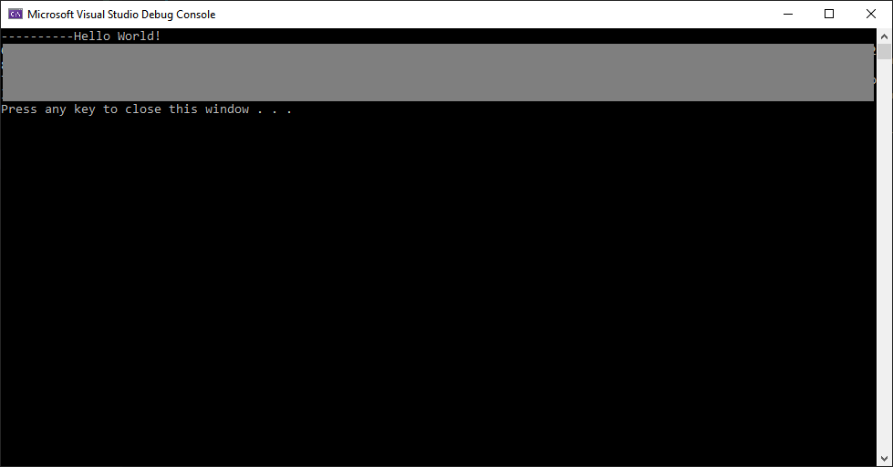
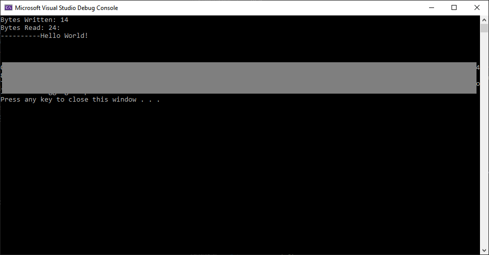
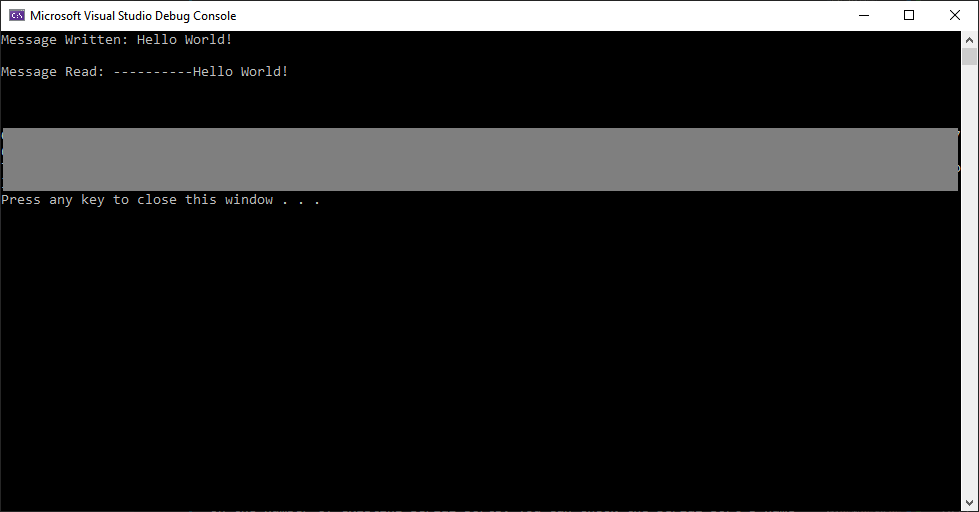

# Serial Communication with Boost

Welcome to my tutorial on how to communicate over a serial port using Boost's Asio library.

## Section 1: Introduction

Consider the following situation: you're an engineer working at a large factory. There is a machine in the factory you are responsible for. Your employer requires regular measurements of the machine's state to ensure its safe operation. What do you do?

Here are some potential solutions:

1. You walk over to the machine and manually make a measurement.
1. You develop a system to automatically make a measurement and save the machine's state to a computer. You walk over to the computer at the end of the day and download the day's log file.

Given a desired number and frequency of measurements, there's a number of issues with the first option: you may need to constantly take measurements, you may mis-count the number of measurements you've made, you may not record a measurement accurately, etc. A more satisfactory solution is the last option: an embedded system consisting of a sensor, amplifier, microcontroller, power supply, and PC-interface that will allow for consistent, continuous measurements. The last solution could be extended further to include automatic, emergency shutdown.

The problem is, how can an embedded system communicate with a PC? Fortunately, there are a number of tools, e.g. [PuTTY](https://www.putty.org/), and software framework and libraries, e.g. [Qt](https://www.qt.io/) and [Boost](https://www.boost.org/), which have been developed to facilitate this. PuTTY allows users to connect to a desired serial port and read and write raw data, e.g. a string. Qt provides its serial port module and Boost provides the Asio library, which both allow for communicating with a physical or virtual COM port.

In this tutorial, I will show you how to use Boost's Asio library to communicate over a serial port using the RS-232 protocol. Sample 1 shows how to synchronously read and write to a serial port; Sample 2 shows how to asynchronously read and write to a serial port; and Sample 3 shows how asynchronously read and write to a serial port using a class structure. The remainder of this tutorial is structured as follows: Section 2 describes the tutorial's requirements; Section 3 describes how to build the tutorial's samples; Section 4 presents and describes Sample 1's source code; Section 5 presents an activity for you to complete; Section 6 presents and describes Sample 2's source code; Section 7 presents an activity for you to complete; Section 8 presents and describes Sample 3's source code; Section 9 presents an activity for you to complete; and Section 10 concludes the tutorial.

## Section 2: Requirements

### Windows

You need the following programs and libraries installed on your computer to build the tutorial's samples and activities:

1. [CMake](https://cmake.org/).
1. [Boost](https://www.boost.org/).
1. [Visual Studio IDE](https://visualstudio.microsoft.com/).
1. [Arduino IDE](http://arduino.cc/).

This tutorial has been validated using the following software versions and hardware:

1. CMake 3.14
1. Boost 1.70.0
1. Visual Studio IDE 2019, Community Edition
1. Arduino 1.8.9
1. Arduino Uno REV 3 (or similar, e.g. an Arduino Nano or Arduino Mega)

If you haven't got these installed, click on each link to go to the program's respective website. To install CMake and Visual Studio IDE, run the respective installer. Most Boost libraries are header-only, i.e. they consist entirely of header files containing templates and inline functions, and require no separately-compiled library binaries or special treatment when linking. However, some libraries, e.g. Boost.Chrono, must be built separately. More information about getting started with Boost can be found [here](https://www.boost.org/doc/libs/1_70_0/more/getting_started/windows.html).

If you'd like to use an alternative to Microsoft's Visual Studio Integrated Development Environment (IDE), consider Microsoft's [Visual Studio Code](https://code.visualstudio.com/). It's a light-weight, flexible alternative to Visual Studio IDE.

Once you've CMake, Boost, and an IDE installed, you're ready to get started.

## Section 3: Build Instructions

This tutorial contains the following files:

1. [./README.md](./README.md)
1. [./activity_1/client/CMakeLists.txt](./activity_1/CMakeLists.txt)
1. [./activity_1/main.cpp](./activity_1/main.cpp)
1. [./activity_1/main.hpp](./activity_1/main.hpp)
1. [./activity_2/client/CMakeLists.txt](./activity_2/CMakeLists.txt)
1. [./activity_2/main.cpp](./activity_2/main.cpp)
1. [./activity_2/main.hpp](./activity_2/main.hpp)
1. [./activity_3/client/CMakeLists.txt](./activity_3/CMakeLists.txt)
1. [./activity_3/main.cpp](./activity_3/main.cpp)
1. [./activity_3/main.hpp](./activity_3/main.hpp)
1. [./sample_1/CMakeLists.txt](./sample_1/CMakeLists.txt)
1. [./sample_1/main.cpp](./sample_1/main.cpp)
1. [./sample_1/main.hpp](./sample_1/main.hpp)
1. [./sample_2/CMakeLists.txt](./sample_2/CMakeLists.txt)
1. [./sample_2/main.cpp](./sample_2/main.cpp)
1. [./sample_2/main.hpp](./sample_2/main.hpp)
1. [./sample_3/CMakeLists.txt](./sample_3/CMakeLists.txt)
1. [./sample_3/main.cpp](./sample_3/main.cpp)
1. [./sample_3/main.hpp](./sample_3/main.hpp)
1. [./sample_3/serial.cpp](./sample_3/serial.cpp)
1. [./sample_3/serial.hpp](./sample_3/serial.hpp)
1. [./serial_sketch/serial_sketch.ino](./serial_sketch/serial_sketch.ino)

The sample_1 sub-directory contains source code that shows you how to synchronously read and write data via serial port using RS-232. The sample_2 sub-directory contains source code that shows you how to asynchronously read and write data via a serial port using RS-232. The sample_3 sub-directory contains source code that shows you how to asyncrhonously read and write data via a serial port using RS-232 and a class structure. The activity_1, activity_2, and activity_3 sub-directories contain projects set-up for you to complete the tutorial's actvitities. The serial_sketch sub-directory contains an Arduino program used to validate the tutorial's samples' functionality.

### Windows

The following describe how to build the tutorial's sample and activity using either: 1) console commands, or 2) Visual Studio IDE.

### Console Commands

To build a Debug version of a sample or activity, browse to its directory via the command line and use the following commands:

    mkdir build
    cd build
    cmake -G "Visual Studio 16 2019" ..
    cmake --build . --config Debug --target install

To run the built binary, browse to the bin sub-directory and use the following commands:

    cd ..
    cd bin
    .\project.exe

To build a Release version of a sample or activity, browse to its directory via the command line and use the following commands:

    mkdir build
    cd build
    cmake -G "Visual Studio 16 2019" ..
    cmake --build . --config Release --target install

To run the built binary, browse to the bin sub-directory and use the following commands:

    cd ..
    cd bin
    .\project.exe

### Visual Studio IDE

To build a Debug version of a sample or activity:

1. Open Visual Studio IDE
1. Click on 'File > Open > CMake'
1. Browse to the sample or activity's directory
1. Select 'CMakeLists.txt' and click on 'Open'
1. Click 'Build > Build All'

To run the built binary:

1. Click 'Debug > Start'

To change the build configuration:

1. Click 'Project > Change CMake Settings for project'
1. Select the build configuration

To build a 64-bit, debug application, select 'x64-Debug'; to build a 64-bit, release application, select 'x64-Release'. CMake's default is a 64-bit, debug configuration.

## Section 4: Sample 1

This sample shows how to syncrhonously read and write data over serial port.

Browse to the sample_1 sub-directory. Let's have a look at the sample's source code.

main.hpp

```cpp
#ifndef __MAIN_HPP__
#define __MAIN_HPP__

#include <iostream>
#include <boost/asio.hpp>

#endif //!__MAIN_HPP__
```

main.cpp

```cpp
#include "main.hpp"

int main(int argc, char* argv[]) {

	try {

		boost::asio::io_context io;

		boost::asio::serial_port serial(io, "COM4");

		serial.set_option(boost::asio::serial_port_base::baud_rate(115200));
		serial.set_option(boost::asio::serial_port_base::character_size(8));
		serial.set_option(boost::asio::serial_port_base::parity(boost::asio::serial_port_base::parity::none));
		serial.set_option(boost::asio::serial_port_base::stop_bits(boost::asio::serial_port_base::stop_bits::one));

		std::string data{ "Hello World!\r\n" };

		boost::asio::write(serial, boost::asio::buffer(data, data.size()));
		
		bool read{ true };

		while (read) {

			char c{ NULL };

			boost::asio::read(serial, boost::asio::buffer(&c, 1));

			switch (c) {
			case '\r':
				break;
			case '\n':
				read = false;
				break;
			default:
				std::cout << c;
			}

		}

		serial.close();

	}
	catch (boost::system::error_code & e) {

		std::cout << e << std::endl;

		return 1;

	}

	return 0;
}
```

Let's go through main.hpp, block by block.

The block

```cpp
#ifndef __MAIN_HPP__
#define __MAIN_HPP__
    ...
#endif //!__MAIN_HPP__
```

defines a header guard, which prevents including a header file more than once. When main.hpp is included, the first thing it does is check if `__MAIN_HPP__` has been defined. If it hasn't, it defines `__MAIN_HPP__` and declares and defines any objects specified. If is has been defined, the entire header is ignored. More informaiton about header guards can be found [here](https://www.learncpp.com/cpp-tutorial/header-guards/).

The block

```cpp
#include <iostream>
#include <boost/asio.hpp>
```

instructs the preprocessor to copy the contents of iostream and asio.hpp to main.cpp. The iostream header defines the standard Input and Output (I/O) stream objects. The asio header defines network and low-level I/O objects. In this sample, we use iostream's and asio.hpp's contents to display text to the user and communicate over a serial port via the RS-232 protocal.
More information about Boost's Asio library can be found [here](https://www.boost.org/doc/libs/1_70_0/doc/html/boost_asio.html).

Now, let's consider main.cpp, block by block.

The block

```cpp
 int main(int argc, char* argv[]) {
     ...
     return 0;
 }
```

defines the program's entry point. ```main()``` has two parameters, ```int argc```, and ```char* argv[]```, and returns an ```int``` value. ```argc``` is the number of command-line parameters; ```argv``` is an array of the command-line parameters. In this sample, we don't use either parameter. If the program completes successfully, the program returns 0.

The block

```cpp
try {
    ...
} catch(std::exception& e) {

    std::cout << e.what() << std::endl;

    return 1;

}
```

defines a try block and a catch block. In the try block, we try to read from and write to a serial port. If an exception is raised, the program's execution proceeds to the catch block, which processes a `std::exception` type exception. The handler displays what exception was raised and the program returns 1. More information about exception handling can be found [here](https://www.learncpp.com/cpp-tutorial/142-basic-exception-handling/).

The line

```cpp
boost::asio::io_context io;
```

defines an instance of the Asio library's `io_context` class. It provides core synchronous and asynchronous I/O functionality. More information about `io_context` can be found [here](https://www.boost.org/doc/libs/1_70_0/doc/html/boost_asio/reference/io_context.html).

The line

```cpp
boost::asio::serial_port serial(io, "COM4");
```

defines an instance of the Asio library's `serial_port` class. It provides serial port functionality. Here, the class has been instantiated using the variable `io` and the serial port's name. More information about `serial_port` can be found [here](https://www.boost.org/doc/libs/1_70_0/doc/html/boost_asio/reference/serial_port.html).

The block

```cpp
serial.set_option(boost::asio::serial_port_base::baud_rate(115200));
serial.set_option(boost::asio::serial_port_base::character_size(8));
serial.set_option(boost::asio::serial_port_base::parity(boost::asio::serial_port_base::parity::none));
serial.set_option(boost::asio::serial_port_base::stop_bits(boost::asio::serial_port_base::stop_bits::one));
```

uses `serial`'s `set_option()` member function to set the serial port's baud rate, character size, parity, and number of stop bits as 115200 bps, 8 bits, no parity, and one stop bit, respectively. `set_option()` is a function template and has 2 overloads. Here, it is used with one parameter, `const SettableSerialPortOption& option`, and does not return any values. `option` is the option value to be set on the serial port. More information about `set_option()` can be found here [here](https://www.boost.org/doc/libs/1_70_0/doc/html/boost_asio/reference/basic_serial_port/set_option/overload1.html).

The line

```cpp
std::string data{ "Hello World!\r\n" };
```

defines an instance of a string. In this sample, "Hello World!\r\n" is the message that is sent to the serial port.

The line

```cpp
boost::asio::write(serial, boost::asio::buffer(data, data.size()));
```

synchronously writes all the supplied data to the serial port before returning. `write()` is a function template and has 16 overloads. Here, it is used with two parameters, `SyncWriteStream& s` and `const ConstBufferSequence& buffers`, and returns a `size_t` value of bytes written. `s` is the stream to which the data is to be written; and `buffers` is one or more buffers containing the data to be written. More information about `write()` can be found [here](https://www.boost.org/doc/libs/1_70_0/doc/html/boost_asio/reference/write.html).

The block

```cpp
while (read) {

    char c{ NULL };

    boost::asio::read(serial, boost::asio::buffer(&c, 1));

    switch (c) {
    case '\r':
        break;
    case '\n':
        read = false;
        break;
    default:
        std::cout << c;
    }

}
```

defines a while loop that syncrhonously reads a single character from the serial port until a '\n' character is received.

Here, the Asio library's `read()` is used to synchronously read a certain amount of data from a stream before returning. `read()` is a function template and has 16 overloads. Here, it is used with two parameters, `SyncReadStream& s` and `const MutableBufferSequence & buffers`, and returns a `size_t` value of bytes read. `s` is the stream from which the data is to be read; and `buffers` is one or more buffers into which the data will be read. More information about `write()` can be found [here](https://www.boost.org/doc/libs/1_70_0/doc/html/boost_asio/reference/read/overload1.html).

The line

```cpp
serial.close();
```

uses `serial`'s `close()` member function to close the serial port.

Now that we've looked at the sample's source code, build its binary.

For it to run properly, you need to have a "COM4" serial port available on your computer. To create a serial port, plug an Arduino into your computer. It will enumerate as "USB Serial Device (COMX)", where 'x' is a number depending on the number of existing serial ports. You can check the serial ports name via your computer's Device Manager.

To have the Arduino echo the string sent to it, upload the sketch in the tutorial's serial_sketch sub-directory.

Run the binary. You should see the following image displayed:

<div>
<center>
<p>Figure: Sample 1's Output. Sample 1 synchronously writes and reads a single string, "Hello World!\r\n", to and from a serial port.</p>

<center>
</div>

## Section 5: Activity 1

Now that you know how to use Boost's Asio library to communicate over a serial port, complete the following:

1. Write an application that uses Boost's Asio library to synchronously communicate with an Arduino and toggle an LED's state.

The activity_1 sub-directory is set up for you to get started. Also, on an Arduino Uno pin 13 is connected to the user-controlled LED.

## Section 6: Sample 2

This sample shows how to syncrhonously communicate over a serial port.

Browse to the sample_2 sub-directory. Let's have a look at the sample's source code.

main.hpp

```cpp
#ifndef __MAIN_HPP__
#define __MAIN_HPP__

#include <iostream>
#include <boost/asio.hpp>
#include <boost/bind.hpp>

void writeHandle(const boost::system::error_code& e, const std::size_t bytes);

void readHandle(const boost::system::error_code& e, const std::size_t bytes);

#endif //!__MAIN_HPP__
```

main.cpp

```cpp
#include "main.hpp"

void writeHandle(const boost::system::error_code &e, const std::size_t bytes) {

	std::cout << "Bytes Written: " << bytes << std::endl;

}

void readHandle(const boost::system::error_code& e, const std::size_t bytes) {
	
	std::cout << "Bytes Read: " << bytes << ": " << std::endl;

}

int main(int argc, char* argv[]) {

	try {

		boost::asio::io_context io;

		boost::asio::serial_port serial(io, "COM4");

		serial.set_option(boost::asio::serial_port_base::baud_rate(115200));
		serial.set_option(boost::asio::serial_port_base::character_size(8));
		serial.set_option(boost::asio::serial_port_base::parity(boost::asio::serial_port_base::parity::none));
		serial.set_option(boost::asio::serial_port_base::stop_bits(boost::asio::serial_port_base::stop_bits::one));

		std::string data{ "Hello World!\r\n" };

		boost::asio::async_write(serial, boost::asio::buffer(data), boost::bind(writeHandle, boost::asio::placeholders::error, boost::asio::placeholders::bytes_transferred));

		boost::asio::streambuf buf;

		std::istream input(&buf);

		boost::asio::async_read_until(serial, buf, "\n", boost::bind(readHandle, boost::asio::placeholders::error, boost::asio::placeholders::bytes_transferred));

		io.run();

		std::cout << input.rdbuf() << std::endl;	

		serial.close();

	}
	catch (boost::system::error_code &e) {

		std::cout << e << std::endl;

		return 1;

	}
	   
    return 0;
}
```

Let's go through main.hpp, block by block.

The block

```cpp
#ifndef __MAIN_HPP__
#define __MAIN_HPP__
    ...
#endif //!__MAIN_HPP__
```

defines a header guard, which prevents including a header file more than once.

The block

```cpp
#include <iostream>
#include <boost/asio.hpp>
#include <boost/bind.hpp>
```

instructs the preprocessor to copy the contents of iostream, asio.hpp, and bind.hpp to main.hpp. The bind header allows for the generalisation of the standard functions `std::bind1st` and `std::bind2nd`; it supports arbitrary function objects, functions, function pointers, and member function pointers, and is able to bind any argument to a specific value or route input arguments into arbitrary positions. More information about boost's Bind library can be found [here](https://www.boost.org/doc/libs/1_70_0/libs/bind/doc/html/bind.html).

The line

```cpp
void writeHandle(const boost::system::error_code& e, const std::size_t bytes);
```

declares the sample's `writeHandle()`. `writeHandle()` is called at the end of an asyncrhonous write operation. It prints out the number of bytes written to the serial port.

The line

```cpp
void readHandle(const boost::system::error_code& e, const std::size_t bytes, const std::istream &stream);
```

declares the sample's `readHandle()`. `readHandle()` is called at the end of an asyncrhonous read operation. It prints out the number of bytes read from the serial port and the input stream's contents.

Now, let's consider main.cpp, block by block.

The block

```cpp
void writeHandle(const boost::system::error_code &e, const std::size_t bytes) {

    std::cout << "Bytes Written: " << bytes << std::endl;

}
```

defines the sample's `writeHandle()` function. It is called when an asyncrhonous write operation has completed. It has two parameters, `const boost::system::error_code &e` and `const std::size_t bytes`, and does not return a value. `e` is the result of the write operation; and `bytes` is the number of bytes copied from the buffers.

The block

```cpp
void readHandle(const boost::system::error_code& e, const std::size_t bytes) {

    std::cout << "Bytes Read: " << bytes << ": " << std::endl;

}
```

defines the sample's `readHandle()` function. It is called when an asyncrhonous read operation has completed. It has two parameters, `const boost::system::error_code &e` and `const std::size_t bytes`, and does not return a value. `e` is the result of the write operation; and `bytes` is the number of bytes copied from the buffers.

The block

```cpp
 int main(int argc, char* argv[]) {
     ...
     return 0;
 }
```

defines the program's entry point. ```main()``` has two parameters, ```int argc```, and ```char* argv[]```, and returns an ```int``` value. ```argc``` is the number of command-line parameters; ```argv``` is an array of the command-line parameters. In this sample, we don't use either parameter. If the program completes successfully, the program returns 0.

The block

```cpp
try {
    ...
} catch(std::exception& e) {

    std::cout << e.what() << std::endl;

    return 1;

}
```

defines a try block and a catch block. In the try block, we try to write to and read from a serial port. If an exception is raised, the program's execution proceeds to the catch block, which processes a `std::exception` type exception. The handler displays what exception was raised and the program returns 1.

The line

```cpp
boost::asio::io_context io;
```

defines an instance of the asio library's ```io_context``` class. It provides core synchronous and asynchronous I/O functionality.


The line

```cpp
boost::asio::serial_port serial(io, "COM4");
```

defines an instance of the Asio library's `serial_port` class. It provides serial port functionality. Here, the class has been instantiated using the variable `io` and the serial port's name.
The block

```cpp
serial.set_option(boost::asio::serial_port_base::baud_rate(115200));
serial.set_option(boost::asio::serial_port_base::character_size(8));
serial.set_option(boost::asio::serial_port_base::parity(boost::asio::serial_port_base::parity::none));
serial.set_option(boost::asio::serial_port_base::stop_bits(boost::asio::serial_port_base::stop_bits::one));
```

uses `serial`'s `set_option()` member function to set the serial port's baud rate, character size, parity, and number of stop bits as 115200 bps, 8 bits, no parity, and one stop bit, respectively.

The line

```cpp
std::string data{ "Hello World!\r\n" };
```

defines an instance of a string. In this sample, "Hello World!\r\n" is the message that is sent to the serial port.

The line

```cpp
boost::asio::async_write(serial, boost::asio::buffer(data), boost::bind(writeHandle, boost::asio::placeholders::error, boost::asio::placeholders::bytes_transferred));
```

asynchronously writes all the supplied data to the serial port before returning. `async_write()` is a function template and has 8 overloads. Here, it is used with three parameters, `SyncWriteStream& s`, `const ConstBufferSequence& buffers`, and `WriteHandler&& handler`, and returns a `size_t` value of bytes written. `s` is the stream to which the data is to be written; `buffers` is one or more buffers containing the data to be written; and `handler` is the handler to be called when the write operation completes. More information about `async_write()` can be found [here](https://www.boost.org/doc/libs/1_70_0/doc/html/boost_asio/reference/async_write/overload1.html).

The line

```cpp
boost::asio::streambuf buf{ };
```

defines an instance of Asio library's `streambuf` class. It holds a buffer that can be modified. More information about `streambuf` can be found [here](https://www.boost.org/doc/libs/1_70_0/doc/html/boost_asio/reference/streambuf.html).

The line

```cpp
std::istream stream(&buf);
```

defines an instance of the `istream` class. It reads and interprets input from sequences of characters. Here it is instantiated with a reference to `buf`. More information about `istream` can be found [here](http://www.cplusplus.com/reference/istream/istream/).

The line

```cpp
boost::asio::async_read_until(serial, buf, "\n", boost::bind(readHandle, boost::asio::placeholders::error, boost::asio::placeholders::bytes_transferred, boost::ref(stream)));
```

asynchronously reads data into a dynamic buffer sequence, or streambuf, until it contains a delimiter, matches a regular expression, or a function object indicates a match. `async_read_until()` is a function template and has 12 overloads. Here it is used with four parameters, `AsyncReadStream& s`, `DynamicBuffer_v1&& buffers`, `char delim`, and `ReadHandler&& handler`. `s` is the stream from which the data is to be read; `buffers` is the dynamic buffer sequence into which the data will be read; `delim` is the delimiter character; and `handler` is the handler to be called when the read operation completes. More information about `async_read_until()` can be found [here](https://www.boost.org/doc/libs/1_70_0/doc/html/boost_asio/reference/async_read_until/overload1.html).

The line

```cpp
io.run();
```

uses `io`'s `run()` member function to run the io_context object's event processing loop.

The line

```cpp
serial.close();
```

uses `serial`'s `close()` member function to close the serial port.

Now that we've looked at the sample's source code, build its binary.

For it to run properly, you need to have a "COM4" serial port available on your computer. To create a serial port, plug an Arduino into your computer. It will enumerate as "USB Serial Device (COMX)", where 'x' is a number depending on the number of existing serial ports. You can check the serial port's name via your computer's Device Manager.

To have the Arduino echo the string sent to it, upload the sketch in the tutorial's serial_sketch sub-directory.

Run the binary. You should see the following image displayed:

<div>
<center>
<p>Figure: Sample 2's Output. Sample 2 asynchronously writes and reads a single string, "Hello World!\r\n", to and from a serial port.</p>

<center>
</div>

## Section 7: Activity 2

Now that you know how to use Boost's Asio library to communicate over a serial port, complete the following:

1. Write an application that uses Boost's Asio library to asynchronously communicate with an Arduino and toggle an LED's state.

The activity_2 sub-directory is set up for you to get started. Also, on an Arduino Uno pin 13 is connected to the user-controlled LED.

## Section 8: Sample 3

This sample shows how to asyncrhonously communicate over a serial port using a class structure.

Browse to the sample_3 sub-directory. Let's have a look at the sample's source code.

main.hpp

```cpp
#ifndef __MAIN_HPP__
#define __MAIN_HPP__

#include <iostream>
#include <boost/asio.hpp>
#include <boost/bind.hpp>

#include "serial.hpp"

#endif //!__MAIN_HPP__
```

main.cpp

```cpp
#include "main.hpp"

int main(int argc, char* argv[]) {

	try {

		boost::asio::io_context io;

		SerialPort port(io, std::string( "COM4"));

		std::string writeMessage{ "Hello World!\r\n" };

		port.asyncWrite(writeMessage);
		
		std::string readMessage{};

		port.asyncRead(&readMessage);

		io.run();

		port.close();
	

	}
	catch (boost::system::error_code &e) {

		std::cout << e << std::endl;

		return 1;

	}
	   
    return 0;
}
```

serial.hpp

```cpp
#ifndef __SERIAL_HPP__
#define __SERIAL_HPP__

#include <iostream>
#include <boost/asio.hpp>
#include <boost/bind.hpp>

class SerialPort {
public:

	SerialPort(boost::asio::io_context& io, std::string& device);

	void asyncWrite(std::string& message);

	void asyncRead(std::string* message);

	void close();

private:

	void writeHandle(const boost::system::error_code& e, std::size_t bytes);

	void readHandle(const boost::system::error_code& e, std::size_t byes, std::string* message);

	boost::asio::serial_port m_port;

	boost::asio::streambuf m_readBuffer;
	boost::asio::streambuf m_writeBuffer;

};

#endif //!__SERIAL_HPP__
```

serial.cpp

```cpp

#include "serial.hpp"

SerialPort::SerialPort(boost::asio::io_context& io, std::string& device) :
	m_port(io, device)
{

	m_port.set_option(boost::asio::serial_port_base::baud_rate(115200));
	m_port.set_option(boost::asio::serial_port_base::character_size(8));
	m_port.set_option(boost::asio::serial_port_base::parity(boost::asio::serial_port_base::parity::none));
	m_port.set_option(boost::asio::serial_port_base::stop_bits(boost::asio::serial_port_base::stop_bits::one));

}

void SerialPort::asyncWrite(std::string& message) {

	std::ostream output(&m_writeBuffer);

	output << message;

	boost::asio::async_write(m_port, m_writeBuffer.data(), boost::bind(&SerialPort::writeHandle, this, boost::asio::placeholders::error, boost::asio::placeholders::bytes_transferred));

}

void SerialPort::asyncRead(std::string* message) {

	boost::asio::async_read_until(m_port, m_readBuffer, "\n", boost::bind(&SerialPort::readHandle, this, boost::asio::placeholders::error, boost::asio::placeholders::bytes_transferred, message));

}

void SerialPort::close() {

	m_port.close();

}

void SerialPort::writeHandle(const boost::system::error_code& e, std::size_t bytes) {

	boost::asio::const_buffer output = m_writeBuffer.data();

	std::string message(boost::asio::buffers_begin(output),
		boost::asio::buffers_begin(output) + output.size());

	std::cout << "Message Written: " << message << std::endl;

}

void SerialPort::readHandle(const boost::system::error_code & e, std::size_t byes, std::string * message) {

	boost::asio::const_buffer input = m_readBuffer.data();

	*message = std::string(boost::asio::buffers_begin(input),
		boost::asio::buffers_begin(input) + input.size());

	std::cout << "Message Read: " << *message << std::endl;

}
```

Let's go through main.hpp, block by block.

The block

```cpp
#ifndef __MAIN_HPP__
#define __MAIN_HPP__
    ...
#endif //!__MAIN_HPP__
```

defines a header guard, which prevents including a header file more than once.

The block

```cpp
#include <iostream>
#include <boost/asio.hpp>
#include <boost/bind.hpp>

#include "serial.hpp"
```

instructs the preprocessor to copy the contents of iostream, asio.hpp, bind.hpp, and serial.hpp to main.hpp.

Now, let's consider main.cpp, block by block.

The block

```cpp
 int main(int argc, char* argv[]) {
     ...
     return 0;
 }
```

defines the program's entry point. ```main()``` has two parameters, ```int argc```, and ```char* argv[]```, and returns an ```int``` value. ```argc``` is the number of command-line parameters; ```argv``` is an array of the command-line parameters. In this sample, we don't use either parameter. If the program completes successfully, the program returns 0.

The block

```cpp
try {
    ...
} catch(std::exception& e) {

    std::cout << e.what() << std::endl;

    return 1;

}
```

defines a try block and a catch block. In the try block, we try to write to and read from a serial port. If an exception is raised, the program's execution proceeds to the catch block, which processes a `std::exception` type exception. The handler displays what exception was raised and the program returns 1.

The line

```cpp
boost::asio::io_context io;
```

defines an instance of the asio library's `io_context` class. It provides core synchronous and asynchronous I/O functionality.

The line

```cpp
SerialPort port(io, std::string( "COM4"));
```

defines an instance of the sample's `SerialPort` class. `SerialPort` writes data to and reads data asyncrhonously from a serial port. Here, it is instantiated with the variable `io` and the serial port name "COM4". The `SerialPort` class will be described shortly.

The line

```cpp
std::string writeMessage{ "Hello World!\r\n" };
```

defines an instance of a string. In this sample, "Hello World!\r\n" is the message that is sent to the serial port.

The line

```cpp
port.asyncWrite(writeMessage);
```

uses `port`'s `asyncWrite()` member function to asyncrhonously write `writeMessage` to the serial port.

The line

```cpp
std::string readMessage{ };
```

defines an instance of a string. Here, it is initialised with an empty list.

The line

```cpp
port.asyncRead(&readMessage);
```

uses `port`'s `asyncRead()` member function to asyncrhonously read data from the serial port and save it in `readMessage`.

The line

```cpp
io.run();
```

uses `io`'s `run()` member function to run the io_context object's event processing loop.

The line

```cpp
port.close();
```

uses `port`'s `close()` member function to close the serial port.

Now, let's look at serial.hpp, block by block.

The block

```cpp
#ifndef __SERIAL_HPP__
#define __SERIAL_HPP__
    ...
#endif //!__SERIAL_HPP__
```

defines a header guard, which prevents including a header file more than once.

The block

```cpp
#include <iostream>
#include <boost/asio.hpp>
#include <boost/bind.hpp>
```

instructs the preprocessor to copy the contents of iostream, asio.hpp, and bind.hpp to main.hpp.

The block

```cpp
class SerialPort {
public:

	SerialPort(boost::asio::io_context& io, std::string& device);

	void asyncWrite(std::string& message);

	void asyncRead(std::string* message);

	void close();

private:

	void writeHandle(const boost::system::error_code& e, std::size_t bytes);

	void readHandle(const boost::system::error_code& e, std::size_t byes, std::string* message);

	boost::asio::serial_port m_port;

	boost::asio::streambuf m_readBuffer;
	boost::asio::streambuf m_writeBuffer;

};
```

declares the sample's `SerialPort` class. `SerialPort` is a helper class; creating a serial port and asynchronously writing to and reading from a serial port. `SerialPort()` defines the class's serial port; `asyncWrite()` asyncrhonously writes a string to the serial port; `asyncRead()` asynchronously reads a string from the serial port; `writeHandle()` handles the asynchronous write operation; `readHandle()` handles the asyncrhonous read operation; `m_port` is the class's serial port; `m_readBuffer` is the class's read buffer; and `m_writeBuffer` is the class's write buffer.

Now, let's go through serial.cpp, block by block.

The block

```cpp
SerialPort::SerialPort(boost::asio::io_context& io, std::string& device) :
	m_port(io, device)
{

	m_port.set_option(boost::asio::serial_port_base::baud_rate(115200));
	m_port.set_option(boost::asio::serial_port_base::character_size(8));
	m_port.set_option(boost::asio::serial_port_base::parity(boost::asio::serial_port_base::parity::none));
	m_port.set_option(boost::asio::serial_port_base::stop_bits(boost::asio::serial_port_base::stop_bits::one));

}
```

defines the `SerialPort` class's `SerialPort()` constructor. `SerialPort()` has two parameters, `boost::asio::io_context& io` and `std::string& device` and does not return any values. It uses `m_port`'s `set_option()` member function to set the serial port's baud rate, character size, parity, and number of stop bits as 115200 bps, 8 bits, no parity, and one stop bit, respectively.

The block

```cpp
void SerialPort::asyncWrite(std::string& message) {

	std::ostream output(&m_writeBuffer);

	output << message;

	boost::asio::async_write(m_port, m_writeBuffer.data(), boost::bind(&SerialPort::writeHandle, this, boost::asio::placeholders::error, boost::asio::placeholders::bytes_transferred));

}
```

defines the `SerialPort` class's `asyncWrite()` member function. `asyncWrite()` has one parameter, `std::string& message` and does not return any values. A `std::ostream` is used to store `message` in `m_writeBuffer`, which is then asyncrhonously written to the serial port using the Asio library's `async_write()`. When the write operation has completed, the class's `writeHandle()` is called.

The block

```cpp
void SerialPort::asyncRead(std::string* message) {

	boost::asio::async_read_until(m_port, m_readBuffer, "\n", boost::bind(&SerialPort::readHandle, this, boost::asio::placeholders::error, boost::asio::placeholders::bytes_transferred, message));

}
```

defines the `SerialPort` class's `asyncRead()` member function. `asyncRead()` has one parameter, `std::string* message` and does not return any values. The Asio library's `async_read_until()` is used to asynchronously read data from the serial port. When the read operation is completed, the class's `readHandle()` is called.

The block

```cpp
void SerialPort::close() {

    m_port.close();

}
```

defines the `SerialPort` class's `close()` member function. `close()` has no parameters and does not return any values. `m_port`'s `close()` member function is used to close the serial port.

The block

```cpp
void SerialPort::writeHandle(const boost::system::error_code& e, std::size_t bytes) {

	boost::asio::const_buffer output = m_writeBuffer.data();

	std::string message(boost::asio::buffers_begin(output),
		boost::asio::buffers_begin(output) + output.size());

	std::cout << "Message Written: " << message << std::endl;

}
```

defines the `SerialPort` class's `writeHandle()` member function. `writeHandle()` has two parameters, `const boost::system::error_code& e` and `std::size_t bytes`, and does not return any values. `m_writeBuffer`'s `data()` member function is used to instantiate a string, which is then printed on the console.

The block

```cpp
void SerialPort::readHandle(const boost::system::error_code& e, std::size_t byes, std::string* message) {

	boost::asio::const_buffer input = m_readBuffer.data();

	*message = std::string(boost::asio::buffers_begin(input),
		boost::asio::buffers_begin(input) + input.size());

	std::cout << "Message Read: " << *message << std::endl;

}
```

defines the `SerialPort` class's `readHandle()` member function. `readHandle()` has three parameters, `const boost::system::error_code& e`, `std::size_t byes`, and `std::string* message`, and does not return any values. `m_readBuffer`'s `data()` member function is used to instantiate a string, which is then printed on the console.

Now that we've looked at the sample's source code, build its binary.

For it to run properly, you need to have a "COM4" serial port available on your computer. To create a serial port, plug an Arduino into your computer. It will enumerate as "USB Serial Device (COMX)", where 'x' is a number depending on the number of existing serial ports. You can check the serial port's name via your computer's Device Manager.

To have the Arduino echo the string sent to it, upload the sketch in the tutorial's serial_sketch sub-directory.

Run the binary. You should see the following image displayed:

<div>
<center>
<p>Figure: Sample 3's Output. Sample 3 asynchronously writes and reads a single string, "Hello World!\r\n", to and from a serial port using a class structure.</p>

<center>
</div>

## Section 9: Activity 3

Now that you know how to use Boost's Asio library to communicate over a serial port, complete the following:

1. Write an application that uses Boost's Asio library and a class structure to asynchronously communicate with an Arduino and toggle an LED's state.

The activity_2 sub-directory is set up for you to get started. Also, on an Arduino Uno pin 13 is connected to the user-controlled LED.

## Section 10: Conclusion

In this tutorial, I have shown you how to communicate over a serial port using Boost's Asio library.

You have used the Asio library to syncrhonously and asyncrhonously read and write data from and to a serial port.

I hope this tutorial has been useful.

## Credit

Dr Frazer K. Noble  
Department of Mechanical and Electrical Engineering  
School of Food and Advanced Technology  
Massey University  
New Zealand  

Follow me on Twitter <a href="http://twitter.com/DrFrazerNoble" class="twitter-follow-button" data-show-count="false">@DrFrazerNoble</a>
