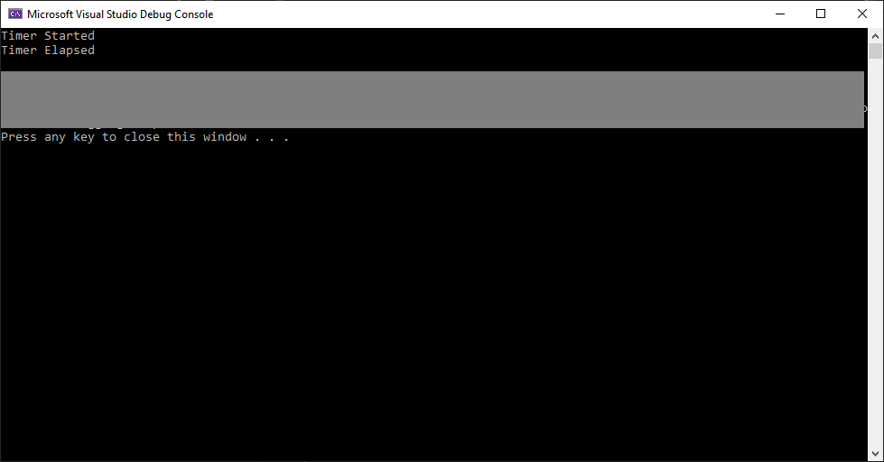
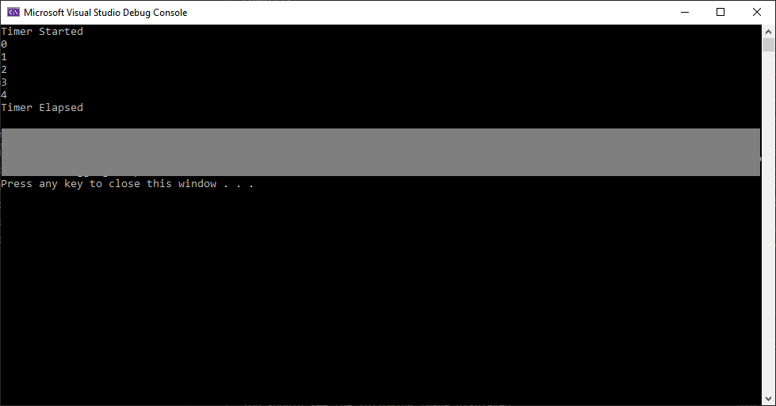
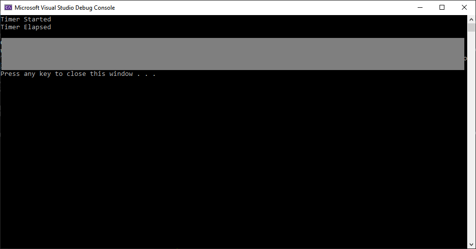
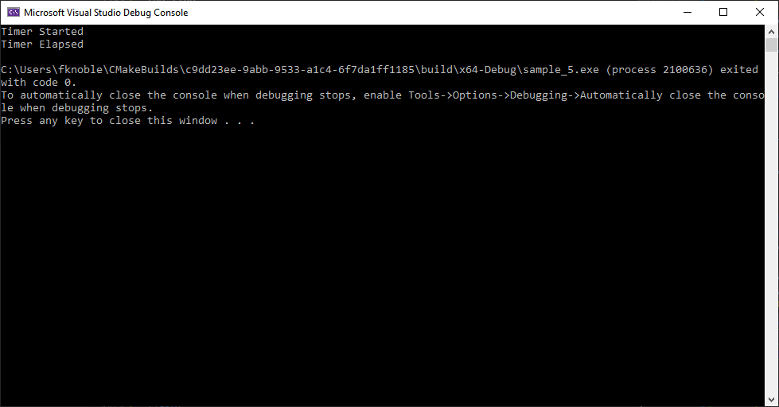

# Timing with Boost

Welcome to my tutorial on timers using Boost's Asio library.

## Section 1: Introduction

Considering the following situation: you're an engineer working at a large factory. There is a machine in the factory you are responsible for. Your employer requires regular measurements of the machine's state to ensure its safe operation. What do you do?

Here are some potential solutions:

1. You walk over to the machine and manually make a measurement. You record the machine's state on a computer.
1. You develop an embedded system to automatically make a measurement and save the machine's state to a memory card. You walk over to the system at the end of the day and copy the day's log from the memory card.
1. You develop an embedded system and PC application to automatically make a measurement and save the machine's state on a computer. You walk over to the system at the end of the day and copy the day's log from the computer.

Given the desired number and frequency of measurements, there's a number of issues with the first two options: the measurement period might be too short; you can only make measurements when your at work; you may want to change the embedded system's timing; changing the embedded system's requires machine down time, etc. A more satisfactory solution is the last option: an embedded system consisting of a sensor, amplifier, microcontroller, power supply, and PC-interface that will allow for a PC application to prompt it for a measurement. The PC application's timing can be changed on the fly, with no change to the embedded system.

The problem is, how can we control the PC application's timing? Fortunately, there are a number of software frameworks and libraries, e.g. [Qt](https://www.qt.io/) and [Boost](https://www.boost.org/), which have been developed to faciliate this. Qt provides its core module and Boost provides the Asio library, which both provide time-based functionality.

In this tutorial, I will show you how to use Boost's Asio library to perform syncrhonous and asynchronous time-based operations. Sample 1 shows you how to syncrhonously wait for a fixed period of time; Sample 2 shows you how to asyncrhonously wait for a fixed period of time; Sample 3 shows you how to asynchronously wait for a fixed period of time and pass a value to a wait handler; Sample 4 shows you how to asyncrhonously wait for a fixed period of time and pass a value to a class's member function; and Sample 5 shows you how to asyncrhonously wait for a fixed period in a separate thread.

The remainder of this tutorial is structured as follows: Section 2 describes the tutorial's requirements; Section 3 describes how to build the tutorial's samples; Section 4 presents and describes Sample 1's source code; Section 5 presents and describes Sample 2's source code; Section 6 presents and describes Sample 3's source code; Section 7 presents an activity for you to complete; Section 8 presents and describes Sample 4's source code; Section 9 presents and describes Sample 5's source code; Section 10 presents an activity for you to complete; and Section 11 concludes the tutorial.

## Section 2: Requirements

### Windows

You need the following programs and libraries installed on your computer to build the tutorial's samples and activities:

1. [CMake](https://cmake.org/).
1. [Boost](https://www.boost.org/).
1. [Visual Studio IDE](https://visualstudio.microsoft.com/).

This tutorial has been validated using the following software versions and hardware:

1. CMake 3.14
1. Boost 1.70.0
1. Visual Studio IDE 2019, Community Edition

If you haven't got these installed, click on each link to go to the program's respective website. To install CMake and Visual Studio IDE, run the respective installer. Most Boost libraries are header-only, i.e. they consist entirely of header files containing templates and inline functions, and require no separately-compiled library binaries or special treatment when linking. However, some libraries, e.g. Boost.Chrono, must be built separately. More information about getting started with Boost can be found [here](https://www.boost.org/doc/libs/1_70_0/more/getting_started/windows.html).

If you'd like to use an alternative to Microsoft's Visual Studio Integrated Development Environment (IDE), consider Microsoft's [Visual Studio Code](https://code.visualstudio.com/). It's a light-weight, flexible alternative to Visual Studio IDE.

Once you've CMake, Boost, and an IDE installed, you're ready to get started.

## Section 3: Build Instructions

This tutorial contains the following files:

1. [./README.md](./README.md)
1. [./activity_1/client/CMakeLists.txt](./activity_1/CMakeLists.txt)
1. [./activity_1/main.cpp](./activity_1/main.cpp)
1. [./activity_1/main.hpp](./activity_1/main.hpp)
1. [./activity_2/client/CMakeLists.txt](./activity_2/CMakeLists.txt)
1. [./activity_2/main.cpp](./activity_2/main.cpp)
1. [./activity_2/main.hpp](./activity_2/main.hpp)
1. [./sample_1/CMakeLists.txt](./sample_1/CMakeLists.txt)
1. [./sample_1/main.cpp](./sample_1/main.cpp)
1. [./sample_1/main.hpp](./sample_1/main.hpp)
1. [./sample_2/CMakeLists.txt](./sample_2/CMakeLists.txt)
1. [./sample_2/main.cpp](./sample_2/main.cpp)
1. [./sample_2/main.hpp](./sample_2/main.hpp)
1. [./sample_3/CMakeLists.txt](./sample_3/CMakeLists.txt)
1. [./sample_3/main.cpp](./sample_3/main.cpp)
1. [./sample_3/main.hpp](./sample_3/main.hpp)
1. [./sample_4/CMakeLists.txt](./sample_4/CMakeLists.txt)
1. [./sample_4/main.cpp](./sample_4/main.cpp)
1. [./sample_4/main.hpp](./sample_4/main.hpp)
1. [./sample_5/CMakeLists.txt](./sample_5/CMakeLists.txt)
1. [./sample_5/main.cpp](./sample_5/main.cpp)
1. [./sample_5/main.hpp](./sample_5/main.hpp)

The sample_1 sub-directory contains source code that shows you how to syncrhonously wait. The sample_2 sub-directory contains source code that shows you how to asynchronously wait. The sample_3 sub-directory contains source code that shows you how to pass a value to an asynchronous wait handler. The sample_4 sub-directory contains source code that shows you how to use a class's member function as an asyncrhonous wait handler. The sample_5 sub-directory contains source code that shows you how to how to asyncrhonously wait in a new thread. The activity_1 and activity_2 sub-directories contain projects set-up for you to complete the tutorial's actvitities. 

### Windows

The following describe how to build the tutorial's sample and activity using either: 1) console commands, or 2) Visual Studio IDE.

### Console Commands

To build a Debug version of a sample or activity, browse to its directory via the command line and use the following commands:

    mkdir build
    cd build
    cmake -G "Visual Studio 16 2019" ..
    cmake --build . --config Debug --target install

To run the built binary, browse to the bin sub-directory and use the following commands:

    cd ..
    cd bin
    .\project.exe

To build a Release version of a sample or activity, browse to its directory via the command line and use the following commands:

    mkdir build
    cd build
    cmake -G "Visual Studio 16 2019" ..
    cmake --build . --config Release --target install

To run the built binary, browse to the bin sub-directory and use the following commands:

    cd ..
    cd bin
    .\project.exe

### Visual Studio IDE

To build a Debug version of a sample or activity:

1. Open Visual Studio IDE
1. Click on 'File > Open > CMake'
1. Browse to the sample or activity's directory
1. Select 'CMakeLists.txt' and click on 'Open'
1. Click 'Build > Build All'

To run the built binary:

1. Click 'Debug > Start'

To change the build configuration:

1. Click 'Project > Change CMake Settings for project'
1. Select the build configuration

To build a 64-bit, debug application, select 'x64-Debug'; to build a 64-bit, release application, select 'x64-Release'. CMake's default is a 64-bit, debug configuration.

## Section 4: Sample 1

This sample shows how to syncrhonously wait for a fixed period of time.

Browse to the sample_1 sub-directory. Let's have a look at the sample's source code.

main.hpp

```cpp
#ifndef __MAIN_HPP__
#define __MAIN_HPP__

#include <iostream>
#include <boost/asio.hpp>

#endif // !__MAIN_HPP__

```

main.cpp

```cpp
#include "main.hpp"

int main(int argc, char* argv[]) {

	try {

		boost::asio::io_context io;

		boost::asio::steady_timer t(io, boost::asio::chrono::seconds(5));

		std::cout << "Timer Started" << std::endl;

		t.wait();

		std::cout << "Timer Elapsed" << std::endl;

	}
	catch (std::exception& e) {

		std::cout << e.what() << std::endl;

		return 1;
	
	}

    return 0;
}
```

Let's go through main.hpp, block by block.

```cpp
#ifndef __MAIN_HPP__
#define __MAIN_HPP__
    ...
#endif //!__MAIN_HPP__
```

defines a header guard, which prevents including a header file more than once. When main.hpp is included, the first thing it does is check if `__MAIN_HPP__` has been defined. If it hasn't, it defines `__MAIN_HPP__` and declares and defines any objects specified. If is has been defined, the entire header is ignored. More informaiton about header guards can be found [here](https://www.learncpp.com/cpp-tutorial/header-guards/).

The block

```cpp
#include <iostream>
#include <boost/asio.hpp>
```

instructs the preprocessor to copy the contents of iostream and asio.hpp to main.cpp. The iostream header defines the standard Input and Output (I/O) stream objects. The asio header defines network and low-level I/O objects. In this sample, we use iostream's and asio.hpp's contents to display text to the user wait for a fixed period of time.
More information about Boost's Asio library can be found [here](https://www.boost.org/doc/libs/1_70_0/doc/html/boost_asio.html).

Now, let's consider main.cpp, block by block.

The block

```cpp
 int main(int argc, char* argv[]) {
     ...
     return 0;
 }
```

defines the program's entry point. ```main()``` has two parameters, ```int argc```, and ```char* argv[]```, and returns an ```int``` value. ```argc``` is the number of command-line parameters; ```argv``` is an array of the command-line parameters. In this sample, we don't use either parameter. If the program completes successfully, the program returns 0.

The block

```cpp
try {
    ...
} catch(std::exception& e) {

    std::cout << e.what() << std::endl;

    return 1;

}
```

defines a try block and a catch block. In the try block, we try to wait for a fixed period of time. If an exception is raised, the program's execution proceeds to the catch block, which processes a `std::exception` type exception. The handler displays what exception was raised and the program returns 1. More information about exception handling can be found [here](https://www.learncpp.com/cpp-tutorial/142-basic-exception-handling/).

The line

```cpp
boost::asio::io_context io;
```

defines an instance of the Asio library's `io_context` class. It provides core synchronous and asynchronous I/O functionality. More information about `io_context` can be found [here](https://www.boost.org/doc/libs/1_70_0/doc/html/boost_asio/reference/io_context.html).

The line

```cpp
boost::asio::steady_timer t(io, boost::asio::chrono::seconds(5));
```

defines an instance of the Asio library's `steady_timer` class. It provides the ability to perform a syncrhonous or asyncrhonous wait for a timer to expire. Here, the class has been instantiated using the variable `io` and a period of 5 seconds. More information about `steady_timer` can be found [here](https://www.boost.org/doc/libs/1_70_0/doc/html/boost_asio/reference/steady_timer.html).

The block

```cpp
std::cout << "Timer Started" << std::endl;

t.wait();

std::cout << "Timer Elapsed" << std::endl;
```

prints out a string to indicate the timer's start and then prints out a string to indicate the timer's elapsed. Here, `t`'s `wait()` member function is used to syncrhonously wait for the defined period. `wait()` two overloads. Here, it is used with no parameters and returns no values. More information about `wait()` can be found [here](https://www.boost.org/doc/libs/1_70_0/doc/html/boost_asio/reference/basic_waitable_timer/wait.html).

Now that we've looked at the sample's source code, build and run its binary. You should see the following image displayed:

<div>
<center>
<p>Figure: Sample 1's Output. Sample 1 synchronously wait for 5 seconds, indicating the timer's start and when it has elapsed.</p>

<center>
</div>

## Section 5: Sample 2

This sample shows how to asyncrhonously wait for a fixed period of time.

Browse to the sample_2 sub-directory. Let's have a look at the sample's source code.

main.hpp

```cpp
#ifndef __MAIN_HPP__
#define __MAIN_HPP__

#include <iostream>
#include <boost/asio.hpp>

void waitHandle(const boost::system::error_code& e);

#endif // !__MAIN_HPP__
```

main.cpp

```cpp
#include "main.hpp"

void waitHandle(const boost::system::error_code& e) {

	std::cout << "Timer Elapsed" << std::endl;

}

int main(int argc, char* argv[]) {

	try {

		boost::asio::io_context io;

		boost::asio::steady_timer t(io, boost::asio::chrono::seconds(5));

		t.async_wait(&waitHandle);

		std::cout << "Timer Started" << std::endl;

		io.run();

	} 
	catch (std::exception& e) {
		
		std::cout << e.what() << std::endl;

		return 1;

	}
	
    return 0;
}
```

Let's go through main.hpp, block by block.

The block

```cpp
#ifndef __MAIN_HPP__
#define __MAIN_HPP__
    ...
#endif //!__MAIN_HPP__
```

defines a header guard, which prevents including a header file more than once.

The block

```cpp
#include <iostream>
#include <boost/asio.hpp>
```

instructs the preprocessor to copy the contents of iostream and asio.hpp to main.hpp.

The line

```cpp
void waitHandle(const boost::system::error_code& e);
```

declares the sample's `waitHandle()` function. `waitHandle()` is called at the end of an asyncrhonous wait operation. It prints out a string on the console.

Now, let's consider main.cpp, block by block.

The block

```cpp
void waitHandle(const boost::system::error_code& e) {

    std::cout << "Timer Elapsed" << std::endl;

}
```

defines the sample's `waitHandle()` function. It is called when an asyncrhonous wait operation has completed. It has one parameter,  `const boost::system::error_code& e`, and does not return any values.

The block

```cpp
 int main(int argc, char* argv[]) {
     ...
     return 0;
 }
```

defines the program's entry point. ```main()``` has two parameters, ```int argc```, and ```char* argv[]```, and returns an ```int``` value. ```argc``` is the number of command-line parameters; ```argv``` is an array of the command-line parameters. In this sample, we don't use either parameter. If the program completes successfully, the program returns 0.

The block

```cpp
try {
    ...
} catch(std::exception& e) {

    std::cout << e.what() << std::endl;

    return 1;

}
```

defines a try block and a catch block. In the try block, we try to wait for a fixed period of time. If an exception is raised, the program's execution proceeds to the catch block, which processes a `std::exception` type exception. The handler displays what exception was raised and the program returns 1.

The line

```cpp
boost::asio::io_context io;
```

defines an instance of the asio library's ```io_context``` class. It provides core synchronous and asynchronous I/O functionality.

The line

```cpp
boost::asio::steady_timer t(io, boost::asio::chrono::seconds(5));
```

defines an instance of the Asio library's `steady_timer` class. It provides the ability to perform a syncrhonous or asyncrhonous wait for a timer to expire. Here, the class has been instantiated using the variable `io` and a period of 5 seconds.

The line

```cpp
t.async_wait(&waitHandle);
```

uses `t`'s `async_wait()` member function to asyncrhonously wait for the defined period. `async_wait()` is a function template and has no overloads. Here, it is used with one parameter, `WaitHandler&& handler`, and does not return any values. `handler` is the handler to be called when the timer expires. More information about `async_wait()` can be found [here](https://www.boost.org/doc/libs/1_70_0/doc/html/boost_asio/reference/basic_waitable_timer/async_wait.html).

The block

```cpp
std::cout << "Timer Started" << std::endl;

io.run();
```

prints out a string to indicate the timer's start and then runs an event processing loop. Here, `io`'s `run()` member function is used to run the io_context object's event processing loop. `run()` has two overloads. Here, it is used with no parameters and does not return any values. More information about `run()` can be found [here](https://www.boost.org/doc/libs/1_70_0/doc/html/boost_asio/reference/io_context/run.html).

Now that we've looked at the sample's source code, build and run its binary. You should see the following image displayed:

<div>
<center>
<p>Figure: Sample 2's Output. Sample 2 asynchronously wait for 5 seconds, indicating the timer's start and when it has elapsed.</p>

<center>
</div>

## Section 6: Sample 3

This sample shows how to asyncrhonously wait for a fixed period of time and pass a value to the wait handler.

Browse to the sample_3 sub-directory. Let's have a look at the sample's source code.

main.hpp

```cpp
#ifndef __MAIN_HPP__
#define __MAIN_HPP__

#include <iostream>
#include <boost/asio.hpp>
#include <boost/bind.hpp>

void waitHandle(const boost::system::error_code& e, boost::asio::steady_timer* t, int* count);

#endif // !__MAIN_HPP__
```

main.cpp

```cpp
#include "main.hpp"

void waitHandle(const boost::system::error_code& e, boost::asio::steady_timer *t, int *count) {

	if (*count < 5) {

		std::cout << *count << std::endl;

		(*count)++;
		t->expires_at(t->expiry() + boost::asio::chrono::seconds(1));
		t->async_wait(boost::bind(waitHandle, boost::asio::placeholders::error, t, count));
		
	}
	else {

		std::cout << "Timer Elapsed" << std::endl;

	}
}

int main(int argc, char* argv[]) {

	try {

		boost::asio::io_context io;

		boost::asio::steady_timer t(io, boost::asio::chrono::seconds(1));

		int count{ 0 };

		t.async_wait(boost::bind(waitHandle, boost::asio::placeholders::error, &t, &count));

		std::cout << "Timer Started" << std::endl;

		io.run();

	}
	catch (std::exception& e) {

		std::cout << e.what() << std::endl;

		return 1;
	}

	return 0;

}
```

Let's go through main.hpp, block by block.

The block

```cpp
#ifndef __MAIN_HPP__
#define __MAIN_HPP__
    ...
#endif //!__MAIN_HPP__
```

defines a header guard, which prevents including a header file more than once.

The block

```cpp
#include <iostream>
#include <boost/asio.hpp>
#include <boost/bind.hpp>
```

instructs the preprocessor to copy the contents of iostream, asio.hpp, and bind.hpp to main.hpp. The bind header allows for the generalisation of the standard functions `std::bind1st` and `std::bind2nd`; it supports arbitrary function objects, functions, function pointers, and member function pointers, and is able to bind any argument to a specific value or route input arguments into arbitrary positions. More information about boost's Bind library can be found [here](https://www.boost.org/doc/libs/1_70_0/libs/bind/doc/html/bind.html).

The line

```cpp
void waitHandle(const boost::system::error_code& e, boost::asio::steady_timer* t, int* count);
```

declares the sample's `waitHandle()` function. `waitHandle()` is called at the end of an asyncrhonous wait operation. It increments a counter and waits an additional 1 second, every 1 second, up to a maximum of 5 seconds. After 5 seconds, it prints out a string on the console.

Now, let's consider main.cpp, block by block.

The block

```cpp
void waitHandle(const boost::system::error_code& e, boost::asio::steady_timer *t, int *count) {

	if (*count < 5) {

		std::cout << *count << std::endl;

		(*count)++;
		t->expires_at(t->expiry() + boost::asio::chrono::seconds(1));
		t->async_wait(boost::bind(waitHandle, boost::asio::placeholders::error, t, count));
		
	}
	else {

		std::cout << "Timer Elapsed" << std::endl;

	}
}
```

defines the sample's `waitHandle()` function. It is called when an asyncrhonous wait operation has completed. `waitHandler()` has three parameters, `const boost::system::error_code& e, boost::asio::steady_timer* t, int* count`. `e` is the result of the operation, `t` is a timer, and `count` is a integer value. If count is less than 5, `waitHandle()` increments count and uses `t`'s `expires_at()` member function to wait an additional second; else, it prints a string on the console. More information about `expires_at()` can be found [here](https://www.boost.org/doc/libs/1_70_0/doc/html/boost_asio/reference/basic_waitable_timer/expires_at.html).

The block

```cpp
 int main(int argc, char* argv[]) {
     ...
     return 0;
 }
```

defines the program's entry point. ```main()``` has two parameters, ```int argc```, and ```char* argv[]```, and returns an ```int``` value. ```argc``` is the number of command-line parameters; ```argv``` is an array of the command-line parameters. In this sample, we don't use either parameter. If the program completes successfully, the program returns 0.

The block

```cpp
try {
    ...
} catch(std::exception& e) {

    std::cout << e.what() << std::endl;

    return 1;

}
```

defines a try block and a catch block. In the try block, we try to wait for a fixed period of time. If an exception is raised, the program's execution proceeds to the catch block, which processes a `std::exception` type exception. The handler displays what exception was raised and the program returns 1.

The line

```cpp
boost::asio::io_context io;
```

defines an instance of the asio library's ```io_context``` class. It provides core synchronous and asynchronous I/O functionality.

The line

```cpp
boost::asio::steady_timer t(io, boost::asio::chrono::seconds(1));
```

defines an instance of the Asio library's `steady_timer` class. It provides the ability to perform a syncrhonous or asyncrhonous wait for a timer to expire. Here, the class has been instantiated using the variable `io` and a period of 1 seconds.

The block

```cpp
int count{ 0 };

t.async_wait(boost::bind(waitHandle, boost::asio::placeholders::error, &t, &count));
```

initialises the variable `count` as 0 and uses `t`'s `async_wait()` member function to asyncrhonously wait for the define period. Here, we have used the Bind library's `bind()` function to bind the sample's `waitHandle()` function to `async_wait()`'s handler definition: `void handler(const boost::system::error_code& error);`, which normally only takes one parameter. More information about `bind()` can be found [here](https://www.boost.org/doc/libs/1_70_0/libs/bind/doc/html/bind.html).

The block

```cpp
std::cout << "Timer Started" << std::endl;

io.run();
```

prints out a string to indicate the timer's start and then runs an event processing loop. Here, `io`'s `run()` member function is used to run the io_context object's event processing loop.

Now that we've looked at the sample's source code, build and run its binary. You should see the following image displayed:

<div>
<center>
<p>Figure: Sample 3's Output. Sample 3 asynchronously waits for 1 second, five times, and indicates the timer's start and when it has elapsed.</p>

<center>
</div>

## Section 7: Activity 1

Now that you know how to use Boost's Asio library to wait for a fixed period of time, complete the following:

1. Write an application that uses Boost's Asio library to print on the console the number of times a timer has asyncrhonously waited 250 ms.

## Section 8: Sample 4

This sample shows how to asyncrhonously wait for a fixed period of time using a class structure.

Browse to the sample_4 sub-directory. Let's have a look at the sample's source code.

main.hpp

```cpp
#ifndef __MAIN_HPP__
#define __MAIN_HPP__

#include <iostream>
#include <boost/asio.hpp>

#include "delay.hpp"

#endif //!__MAIN_HPP__
```

main.cpp

```cpp
#include "main.hpp"

int main(int argc, char* argv[]) {

	try {

		boost::asio::io_context io;

		Delay timer(io);

		timer.delay(5);

		std::cout << "Timer Started" << std::endl;

		io.run();

	}
	catch (std::exception& e) {

		std::cout << e.what() << std::endl;

		return 1;
	}

    return 0;
}
```

delay.hpp

```cpp
#ifndef __DELAY_HPP__
#define __DELAY_HPP__

#include <iostream>
#include <boost/asio.hpp>
#include <boost/bind.hpp>

class Delay {

public:

	Delay(boost::asio::io_context& io);

	void delay(const int& time);


private:

	void timerElapsed(const boost::system::error_code& e);

	boost::asio::steady_timer m_t;

};

#endif //!__DELAY_HPP__
```

delay.cpp

```cpp
#include "delay.hpp"

Delay::Delay(boost::asio::io_context& io) :
	_t(io)
{

}

void Delay::delay(const int& time) {

	m_t.expires_after(boost::asio::chrono::seconds(time));

	m_t.async_wait(boost::bind(&Delay::timerElapsed, this, boost::asio::placeholders::error));

}

void Delay::timerElapsed(const boost::system::error_code& e) {

	std::cout << "Timer Elapsed" << std::endl;

}
```

Let's go through main.hpp, block by block.

The block

```cpp
#ifndef __MAIN_HPP__
#define __MAIN_HPP__
    ...
#endif //!__MAIN_HPP__
```

defines a header guard, which prevents including a header file more than once.

The block

```cpp
#include <iostream>
#include <boost/asio.hpp>

#include "delay.hpp"
```

instructs the preprocessor to copy the contents of iostream, asio.hpp, and delay.hpp to main.hpp.

Now, let's consider main.cpp, block by block.

The block

```cpp
 int main(int argc, char* argv[]) {
     ...
     return 0;
 }
```

defines the program's entry point. ```main()``` has two parameters, ```int argc```, and ```char* argv[]```, and returns an ```int``` value. ```argc``` is the number of command-line parameters; ```argv``` is an array of the command-line parameters. In this sample, we don't use either parameter. If the program completes successfully, the program returns 0.

The block

```cpp
try {
    ...
} catch(std::exception& e) {

    std::cout << e.what() << std::endl;

    return 1;

}
```

defines a try block and a catch block. In the try block, we try to write to wait for a period of time. If an exception is raised, the program's execution proceeds to the catch block, which processes a `std::exception` type exception. The handler displays what exception was raised and the program returns 1.

The line

```cpp
boost::asio::io_context io;
```

defines an instance of the asio library's `io_context` class. It provides core synchronous and asynchronous I/O functionality.

The line

```cpp
Delay timer(io);
```

defines an instance of the sample's `Delay` class. `Delay` provides a member function that asyncrhonously waits for a period of time. Here, it is instantiated with the variable `io`. The `Delay` class with be described shortly.

The line

```cpp
timer.delay(5);
```

uses `timer`'s `delay()` member function to asyncrhonously wait 5 seconds.

The block

```cpp
std::cout << "Timer Started" << std::endl;

io.run();
```

prints out a string to indicate the timer's start and then runs an event processing loop. Here, `io`'s `run()` member function is used to run the io_context object's event processing loop.

Now, let's look at delay.hpp, block by block.

The block

```cpp
#ifndef __DELAY_HPP__
#define __DELAY_HPP__
    ...
#endif //!__DELAY_HPP__
```

defines a header guard, which prevents including a header file more than once.

The block

```cpp
#include <iostream>
#include <boost/asio.hpp>
#include <boost/bind.hpp>
```

instructs the preprocessor to copy the contents of iostream, asio.hpp, and bind.hpp to main.hpp.

The block

```cpp
class Delay {

public:

	Delay(boost::asio::io_context& io);

	void delay(const int& time);


private:

	void timerElapsed(const boost::system::error_code& e);

	boost::asio::steady_timer m_t;

};
```

declares the sample's `Delay` class. `Delay` is a helper class; creating a timer and helping with waiting for a defined period. `Delay()` defines the class's timer; `delay()` asynchronously waits for a defined period; `timerElapsed()` handles the asyncrhonous wait operation; and `m_t` is the class's timer.

Now let's go through delay.cpp, block by block.

The block

```cpp
Delay::Delay(boost::asio::io_context& io) :
	m_t(io)
{

}
```

defines the `Delay` class's `Delay()` constructor. `Delay()` has one parameter, `boost::asio::io_context& io`, and does not return any values. The `m_t` data member is initialised with the variable `io`.

The block

```cpp
void Delay::delay(const int& time) {

	m_t.expires_after(boost::asio::chrono::seconds(time));

	m_t.async_wait(boost::bind(&Delay::timerElapsed, this, boost::asio::placeholders::error));

}
```

deines the `Delay` class's `delay()` member function. `delay()` has one parameter, `const int& time`, and does not return any values. It uses `m_t`'s `expires_after()` member function to set the timer's expiry time `time` seconds relative to now and then asyncrhonously waits for the defined period. More information about `expires_after()` can be found [here](https://www.boost.org/doc/libs/1_70_0/doc/html/boost_asio/reference/basic_waitable_timer/expires_after.html).

The block

```cpp
void Delay::timerElapsed(const boost::system::error_code& e) {

    std::cout << "Timer Elapsed" << std::endl;

}
```

definies the `Delay` class's `timerElapsed()` member function. `timerElapsed()` has one parameter, `const boost::system::error_code& e` and does not return any values. `e` is the result of the operation. Once an asyncrhonous wait operation has completed, it prints out a string on the console.

Now that we've looked at the sample's source code, build and run its binary. You should see the following image displayed:

<div>
<center>
<p>Figure: Sample 4's Output. Sample 3 asynchronously waits for 5 second, using a class structure, and indicates the timer's start and when it has elapsed.</p>

<center>
</div>

## Section 9: Sample 5

This sample shows how to asyncrhonously wait for a fixed period of time using a class structure.

Browse to the sample_4 sub-directory. Let's have a look at the sample's source code.

main.hpp

```cpp
#ifndef __MAIN_HPP__
#define __MAIN_HPP__

#include <iostream>
#include <boost/asio.hpp>
#include <boost/thread.hpp>

#include "delay.hpp"

#endif //!__MAIN_HPP__
```

main.cpp

```cpp
#include "main.hpp"
#include "main.hpp"

int main(int argc, char* argv[]) {

	try {

		boost::asio::io_context io;

		Delay timer(io);

		timer.delay(5);

		std::cout << "Timer Started" << std::endl;

		boost::thread t(boost::bind(&boost::asio::io_context::run, &io));

		io.run();

		t.join();

	} 
	catch (std::exception& e) {

		std::cout << e.what() << std::endl;

		return 1;

	}
	
    return 0;
}
```

delay.hpp

```cpp
#ifndef __DELAY_HPP__
#define __DELAY_HPP__

#include <iostream>
#include <boost/asio.hpp>
#include <boost/bind.hpp>
#include <boost/thread.hpp>

class Delay {

public:

	Delay(boost::asio::io_context& io);

	void delay(const int& time);


private:

	void timerElapsed(const boost::system::error_code& e);

	boost::asio::steady_timer m_t;
	boost::asio::io_context::strand m_strand;

};

#endif //!__DELAY_HPP__
```

delay.cpp

```cpp
#include "delay.hpp"

Delay::Delay(boost::asio::io_context& io) :
	m_t(io),
	m_strand(io)
{
	
}

void Delay::delay(const int& time) {

	m_t.expires_after(boost::asio::chrono::seconds(time));

	m_t.async_wait(m_strand.wrap(boost::bind(&Delay::timerElapsed, this, boost::asio::placeholders::error)));

}

void Delay::timerElapsed(const boost::system::error_code& e) {

	std::cout << "Timer Elapsed" << std::endl;

}
```

Let's go through main.hpp, block by block.

The block

```cpp
#ifndef __MAIN_HPP__
#define __MAIN_HPP__
    ...
#endif //!__MAIN_HPP__
```

defines a header guard, which prevents including a header file more than once.

The block

```cpp
#include <iostream>
#include <boost/asio.hpp>
#include <boost/thread.hpp>

#include "delay.hpp"
```

instructs the preprocessor to copy the contents of iostream, asio.hpp, thread.hpp, and delay.hpp to main.hpp.


Now, let's consider main.cpp, block by block.

The block

```cpp
 int main(int argc, char* argv[]) {
     ...
     return 0;
 }
```

defines the program's entry point. ```main()``` has two parameters, ```int argc```, and ```char* argv[]```, and returns an ```int``` value. ```argc``` is the number of command-line parameters; ```argv``` is an array of the command-line parameters. In this sample, we don't use either parameter. If the program completes successfully, the program returns 0.

The block

```cpp
try {
    ...
} catch(std::exception& e) {

    std::cout << e.what() << std::endl;

    return 1;

}
```

defines a try block and a catch block. In the try block, we try to write to wait for a period of time. If an exception is raised, the program's execution proceeds to the catch block, which processes a `std::exception` type exception. The handler displays what exception was raised and the program returns 1.

The line

```cpp
boost::asio::io_context io;
```

defines an instance of the asio library's `io_context` class. It provides core synchronous and asynchronous I/O functionality.

The line

```cpp
Delay timer(io);
```

defines an instance of the sample's `Delay` class. `Delay` provides a member function that asyncrhonously waits for a period of time. Here, it is instantiated with the variable `io`. The `Delay` class with be described shortly.

The line

```cpp
timer.delay(5);
```

uses `timer`'s `delay()` member function to asyncrhonously wait 5 seconds.

The line

```cpp
boost::thread t(boost::bind(&boost::asio::io_context::run, &io));
```

defines an instance of Boost's Thread library's `thread` class. Boost's Thread library enables the use of multiple threads of execution; providing classes and functions for managing the threads, syncrhonising data between threads, and copying data between threads. Here, we use Boost's Bind library's `bind()` function to bind the the sample's io_context to another thread. More information about the Thread library and `thread` can be found [here](https://www.boost.org/doc/libs/1_70_0/doc/html/thread.html) and [here](https://www.boost.org/doc/libs/1_70_0/doc/html/thread/thread_management.html#thread.thread_management.thread), respectively.

The line

```cpp
io.run();
```

uses `io`'s `run()` member function to run the io_context object's event processing loop.

The line

```cpp
t.join();
```

uses `t`'s `join()` member function to wait for the second thread to finish executing.

Now that we've looked at the sample's source code, build and run its binary. You should see the following image displayed:

<div>
<center>
<p>Figure: Sample 5's Output. Sample 5 asynchronously waits for 5 seconds, in a separate thread, and indicates the timer's start and when it has elapsed.</p>

<center>
</div>

## Section 10: Activity 2

Now that you know how to use Boost's Asio library to wait for a fixed period of time, complete the following:

1. Write an application that uses Boost's Asio library and a class structure to print on the console the number of times a timer has asyncrhonously waited 2 s.

## Section 11: Conclusion

In this tutorial, I have shown you how to perform time-based operations.

You have used the Asio library to syncrhonously and asyncrhnonously wait for a fixed period of time.

I hope this tutorial has been useful.

## Credit

Dr Frazer K. Noble  
Department of Mechanical and Electrical Engineering  
School of Food and Advanced Technology  
Massey University  
New Zealand  

Follow me on Twitter <a href="http://twitter.com/DrFrazerNoble" class="twitter-follow-button" data-show-count="false">@DrFrazerNoble</a>
